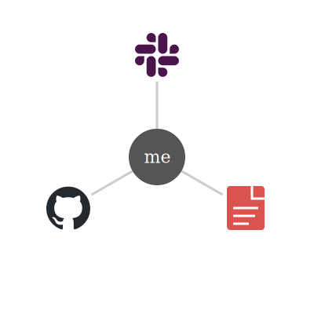
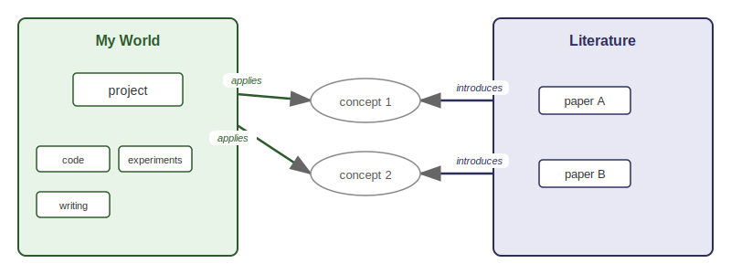

# bipartite

## The Problem

Here is a picture of my world:



In 2025, I sent 8,077 Slack messages, made 1,607 commits, reviewed 186 PRs, created 250 issues, and evaluated hundreds of papers for relevance to our research. I'd like to get agentic help with this in 2026. In order to do so, an agent is going to need to:
1. Work with these services
2. Relate information between within-group activities and the literature

Here is a more detailed picture of my world:



In 2025, agentic coding completely revolutionized my role as an individual researcher because it shortened the distance between idea and implementation. However, it didn't really help my role as a research team lead, because agents don't have all of my knowledge graph.

Bipartite is a tool to give agents that knowledge graph.

## What Bipartite Does

- **[Reference Management](https://matsen.github.io/bipartite/guides/reference-management/)** — An agent-first reference manager: JSON output, CLI interface, git-backed storage. No existing tool (Zotero, Mendeley, Paperpile) gives agents programmatic access to your library.
- **[Knowledge Graph](https://matsen.github.io/bipartite/guides/knowledge-graph/)** — Unlike personal knowledge graphs (Obsidian, Roam), this one connects the literature to your group's projects and is designed for agents to traverse.
- **[Workflow Coordination](https://matsen.github.io/bipartite/guides/workflow-coordination/)** — Themed digests, cross-repo check-ins, and Slack integration for group leaders. We don't know of another tool that synthesizes GitHub activity by research theme for a PI.

## Installation

```bash
go install ./cmd/bip
export PATH="$HOME/go/bin:$PATH"
```

Requires Go 1.21+. For Claude Code skills:

```bash
git clone https://github.com/matsen/bipartite
cd bipartite
ln -s $(pwd)/.claude/skills/* ~/.claude/skills/
```

## License

MIT
