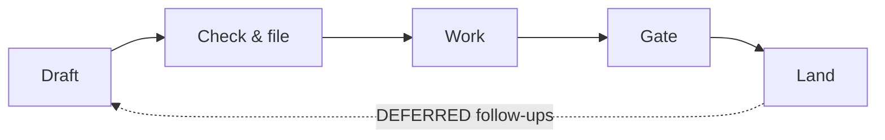

# Issue Lifecycle

Most work in bipartite follows one path: draft an issue, check it, file it, implement it on a branch, gate the PR, land it, and turn its follow-ups into the next issues.
Each step is a skill.
This page gives only the order.
Each skill's own `SKILL.md` (in [`skills/`](https://github.com/matsen/bipartite/tree/main/skills)) says what it does and how, and the `description:` line at its top is the one-line summary.

## 1. Draft

- `/bip-issue-next` drafts `ISSUE-<slug>.md` in the repo root from a PR's follow-ups, a focus file, or the current conversation, then hands it to `/bip-issue-check`.
- `/bip-issue-iterate` works through a draft paragraph by paragraph with you over many rounds, for one that needs to get smaller and more correct first.
- `/bip-remove-metaspeak` cuts reasoning-out-loud residue from a draft that has been through several rounds.

`ISSUE-*.md` files are drafts and are never committed.

## 2. Check and file

- `/bip-issue-check ISSUE-<slug>.md` reviews the draft for implementation-readiness, fixes gaps, and submits it via `/bip-issue-file`.
- `/bip-issue-update N` re-checks an issue that is already filed, which may have drifted from the code since.

## 3. Work

Pick one by where you want the work to run:

| Where | How |
|-------|-----|
| This session | `/bip-issue-work N` |
| A new tmux window with the issue loaded | `bip spawn org/repo#N` ([Workflow Coordination](workflow-coordination.md#spawning-sessions)) |
| An EPIC's clone pool, autonomously | `/bip-conductor-spawn`, run from a `/bip-conductor` session (see the README's orchestration section) |

The worker branches (per-issue worktrees are optional: see [Worktree Layout](layout.md)), implements, and opens a PR with `Closes #N`.
Work it can't fold in goes in the PR body's `DEFERRED` section.

## 4. Gate

- `/bip-pr-check` is the quick readiness check (clean tree, description, body).
- `/bip-pr-review` is the full pre-merge review. It uses the repo's `PRE-MERGE-CHECKLIST.md` if there is one.
- `/bip-comment-check` checks a reviewer's comment against the code before you act on it.

## 5. Land

`/bip-pr-land` squash-merges the PR, deletes its branches, and returns to an up-to-date `main`.
Follow-ups from `DEFERRED` go back to step 1 via `/bip-issue-next <PR>`.

## Across context resets

A session that fills its context runs `/bip-tuckin` before `/clear` and `/bip-continue` after ([Continuation prompt](continuation-prompt.md)).
A fresh session dropped into a spawned clone that already has a PR or a stalled worker starts with `/bip-spawn-resume`.
