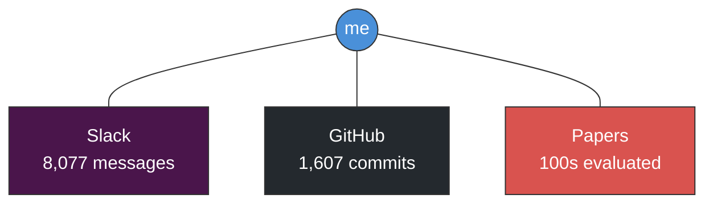
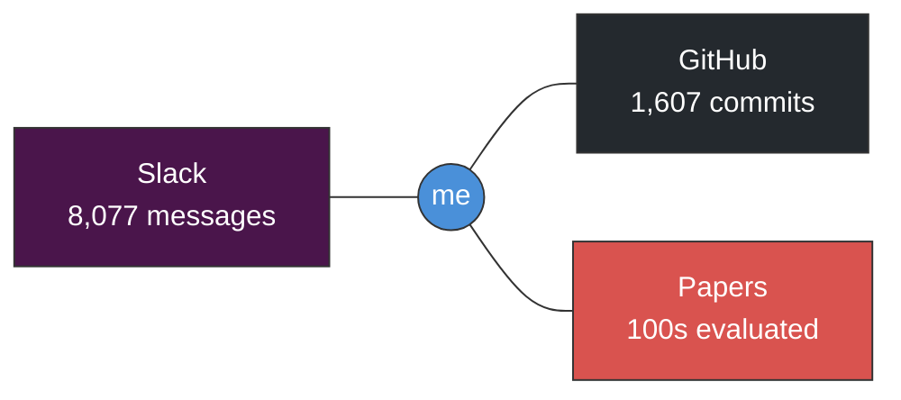
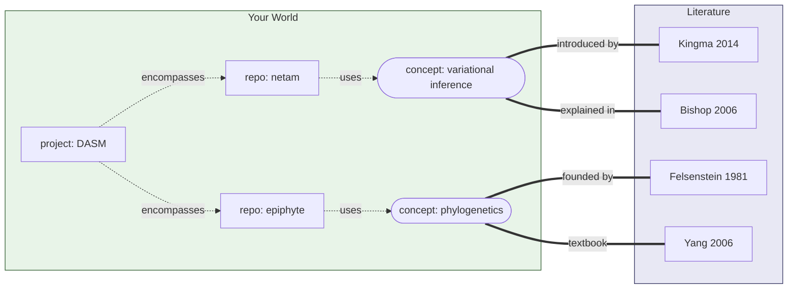
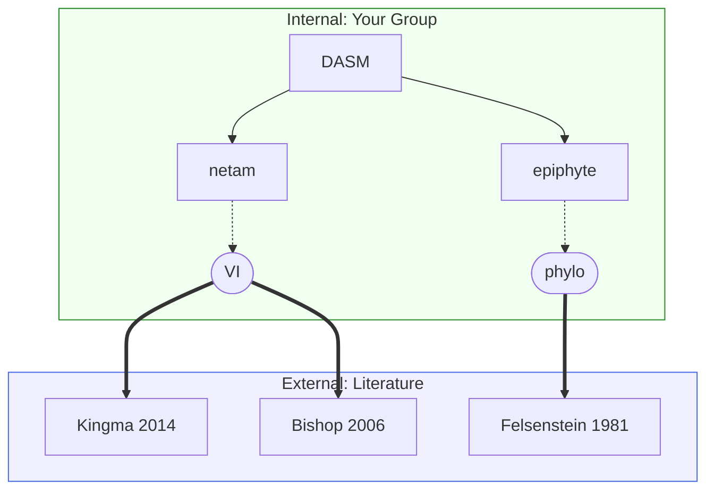

# README Diagrams

## Diagram 1: My Digital World (3-spoke)

Simple hub-and-spoke showing where a team lead's time goes.

### Alternate version (horizontal)

## Diagram 2: Knowledge Graph (Inside/Outside)

The bipartite structure: internal world on left, external literature on right.

### Alternate: Vertical divide

---

## Stats to highlight

From the user's 2025 data, the most impressive combo might be:

- **8,077 Slack messages** - shows communication load
- **1,607 commits** - shows active IC work too
- **186 PRs reviewed** - shows leadership/mentorship role

Or pick two:
- "1,600+ commits and 186 PR reviews" (emphasizes dual role)
- "8,000+ Slack messages evaluating 100s of papers" (emphasizes coordination)
